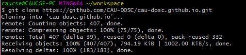

# GitHub에서 Visual Studio 프로젝트 복사하기

## GitHub 프로젝트 페이지에서 Git 주소 복사하기

GitHub의 프로젝트 페이지로 접속하여 오른쪽의 을 클릭하여 HTTPS 주소를 복사합니다. ([SSH 설정](https://help.github.com/articles/connecting-to-github-with-ssh/)을 하였다면, SSH 주소를 복사하여도 됩니다)


## git clone 명령어로 저장소 복사하기

```
$ git clone <주소> <디렉토리 경로>
```

위 형식의 명령어를 통해 주소의 Git 저장소를 특정 디렉토리로 복사합니다. 만약 디렉토리 경로는 생략할 수 있으며, 생략할 경우 GitHub 상의 프로젝트 이름으로 디렉토리 경로가 지정됩니다.



## 프로젝트 열기

git-bash에서 `explorer` 명령어로 윈도우 탐색기를 열 수 있습니다. 탐색기를 열어 저장소 내의 `.sln` 파일을 실행하여 Visual Studio 프로젝트를 열 수 있습니다.

```
$ explorer <Git 디렉토리 경로>
```
