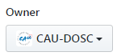
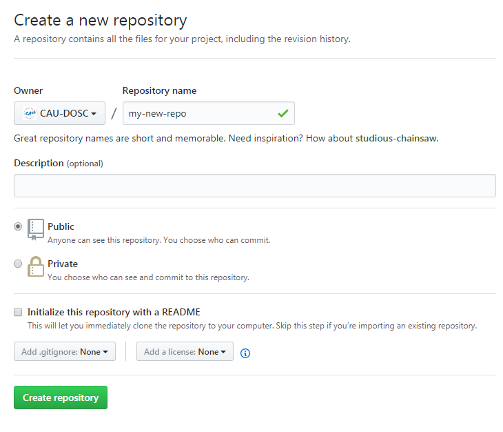
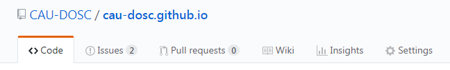
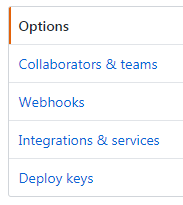
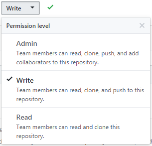
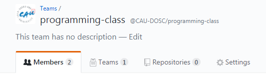
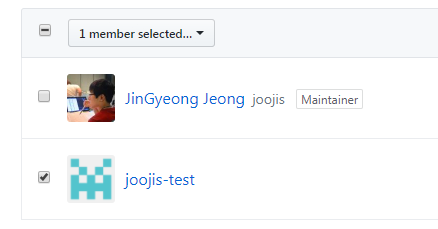
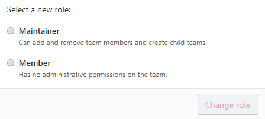

# CAU-DOSC 조직 내 팀 및 프로젝트 생성

## CAU-DOSC 조직 가입하기 (관리자 승인 필요)

1. jjg.joojis@gmail.com 으로 GitHub 아이디와 이름을 보내면 관리자가 확인 후 초대를 보냅니다.
2. GitHub에 로그인하면 나타나는 `View Invitation`을 클릭합니다. 

   > 

3. 초대 페이지에서 `Join ...(조직이름)` 버튼을 누릅니다.

   > 

3. 조직 내에서 팀/프로젝트를 생성하기 위해선 GitHub 계정의 이메일 인증이 되어 있어야 합니다. 이메일 설정을 미리 확인하세요.
   - [https://github.com/settings/emails](https://github.com/settings/emails)

## 팀 생성하기

1. 조직 메인페이지([https://github.com/CAU-DOSC](https://github.com/CAU-DOSC))로 이동합니다.
2.  탭을 선택합니다.
3.  버튼을 눌러 팀 생성 페이지로 이동합니다.
4. `Team name`을 입력하고 `Parent Team`을 선택한 뒤  버튼을 눌러 팀을 생성합니다.

   > `Parent Team`은 소속된 수업에서 지정한 Team을 선택하세요. 해당 Team을 선택할 수 없는 경우 권한이 없는 것이므로 관리자에게 문의하세요. 

## 팀원 초대하기

1. 생성된 팀 페이지에서  버튼을 누릅니다.
2. 나온 창에서 초대하려는 팀의 GitHub 아이디나 이메일을 입력해 추가합니다.
   - 추가하려는 팀원이 조직 소속이 아니면 추가되지 않습니다.

## 프로젝트 생성하기

1. GitHub 오른쪽 상단의  드롭다운 버튼을 누르고 을 눌러 저장소 생성 페이지로 이동합니다.
2. 프로젝트 생성 탭에서 `Owner`를 CAU-DOSC로 지정합니다.
   
   > 

3. `Repository Name` 항목에 저장소 이름을 입력하고 를 눌러 저장소를 생성합니다.

   > 

## 프로젝트에 팀 등록하기

생성한 저장소에 다른 사람이 `git push` 하기 위해서는 저장소 설정에서 Collaborator 혹은 Team으로 추가되어야 합니다.

1. 프로젝트 메인 페이지에서  탭으로 이동합니다. 저장소 생성자 혹은 관리자가 아니면 이 탭이 보이지 않습니다.

   > 

2. Settings 탭에서 오른쪽의 `Collaborators & Teams` 항목을 클릭해 해당 페이지로 이동합니다.

   > 

3. Teams 항목에서 `Select Team`을 눌러 나오는 창에서 추가할 팀을 선택합니다.
4. 추가된 팀의 권한을 `Read`에서 `Write`로 변경합니다.

   > 

## 팀 권한 위임하기

팀 내에 새로운 팀을 추가하거나 팀원을 초대할 수 있도록 다른 사람에게 권한을 위임할 수 있습니다.

1. 해당 팀 페이지에서  탭을 선택합니다.

   > 

2. 멤버 리스트에서 권한을 위임할 멤버 왼쪽의 체크박스를 선택합니다.

   > 

3. 멤버를 선택하면 리스트 상단에 나타나는  드롭다운 버튼을 누르고 `Change role...`을 클릭합니다.
4. 나타난 창에서 `Maintainer`를 선택하고 `Change role` 버튼을 선택합니다.

   > 
