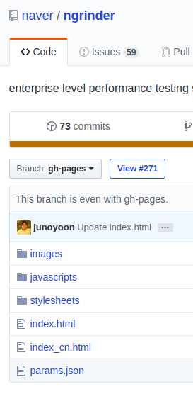

# 오픈소스 프로젝트 개발 및 기여하기

## 기여 할 오픈소스 프로젝트 선택의 예

- 관심이 있거나 써본 적 있는 오픈소스 소프트웨어 (생산성 도구, OS, IDE 등)
- 개발하면서 사용해 본 적이 있는 오픈소스 라이브러리 혹은 프레임워크
  > 라이브러리나 프레임워크 사용 시에 불편했던 점이나 필요했던 기능을 추가하는 시도를 해볼 수 있습니다. 직접 사용해 본 경험을 가지고 있기 때문에 문서나 기능 개선에 있어서 아이디어를 많이 낼 수 있습니다.
- 개발하면서 사용해 본 적이 있는 오픈소스 개발 플러그인
  > 이클립스나 VS Code 등의 플러그인, 자신이 사용해 본 언어, 개발 프레임워크 등과 관련된 단축키 혹은 자동화를 추가하는 간단한 코드부터 시작해 볼 수 있습니다.

## 개발 참여하기

### 실행 및 디버깅 환경 구축, 사용해보기

일반적으로 README 파일에 의존성 설치와 빌드 방법, 실행 방법이 기술되어 있습니다. 소스코드를 다운받고 그 내용을 따라 실행까지 해보고, 그 과정에서 개발 환경이 구축됩니다. 만약 이 과정에서 어떤 에러로 막히게 된다면 이슈로 등록해 도움을 요청할 수 있습니다.

### 개발 가이드 여부 확인하기

README 혹은 README 내에 링크된 Contributing.md 파일에 가이드가 있을 수 있습니다. 이 가이드에는 주로 "지켜야 할 것"들이 적혀 있습니다(예: git push --force master 하지 말 것).

[Contributing.md 예제](https://gist.github.com/PurpleBooth/b24679402957c63ec426)

- Pull Request Process
- Coding Styles
- Testing
- Community Rules
- ...

### 패치 작성 시 주의사항

패치를 작성하였으면 해당 패치가 정상적으로 동작하는지 최소한의 확인 과정을 거치는 것이 기본입니다. 만약 기능을 추가하는 패치라면 추가된 기능에 대한 테스트를 패치에 포함하여 제출하는 것이 좋습니다. 그리고 기타 오픈소스 프로젝트가 정하고 있는 Contribution 가이드라인을 지키고 있는지 확인해야 합니다. 커밋 메시지가 불명확하다는 이유로도 패치가 거절될 수 있습니다.

### 문서화 기여

프로젝트가 어떤 방식으로 문서화를 하고 있는지 파악하여 해당 방식에 따라 기여 방법이 달라집니다. 각 프로젝트마다 여러 문서화 방식을 가지고 있을 수 있고, 용도에 따라 구분할 수 있습니다. GitHub Wiki는 개발자용으로, GitHub Pages는 개발자겸 사용자 대상으로 쓰이는 경향이 있습니다.

#### Wiki

GitHub 저장소의 "Wiki" 탭에서 볼 수 있습니다. 저장소 관리자가 비활성화하면 보이지 않습니다. 일반적으로 해당 저장소에 Push 권한이 있는 사람이 수정할 수 있습니다. 저장소에 따라 누구나 수정할 수 있는 위키도 있습니다. 수정하고 싶은데 권한이 Issues에 관련 내용을 등록하거나 (만약 있다면)Contribution 가이드라인에 따라 수정을 요구할 수 있습니다.

#### GitHub Pages

GitHub 저장소 설정에 따라 gh-pages 브랜치나 "docs" 디렉토리에 웹페이지(HTML, JS, CSS) 코드를 넣으면 GitHub Pages 서비스에 의해 웹페이지 형태로 문서를 서비스할 수 있습니다. GitHub 저장소의 코드로 저장되기 때문에 수정은 Push 권한이 반드시 필요합니다. Pull Request 방식을 통해서 직접 수정한 내용을 반영해 달라고 요청할 수 있습니다.

GitHub Pages는 문서화 외 데모 페이지 혹은 프로젝트 소개 용도로 주로 쓰입니다.

#### 기타 문서화 시스템

- [\[project-name\].readthedocs.io](https://readthedocs.org/)
- [MkDocs](http://www.mkdocs.org/)
- ...

---

### 참고자료

[https://naver.github.io/OpenSourceGuide/book/index.html](https://naver.github.io/OpenSourceGuide/book/index.html)
> 네이버 오픈소스 가이드, 국문

[https://opensource.guide/](https://opensource.guide/)
> Open Source Guides, 영문
