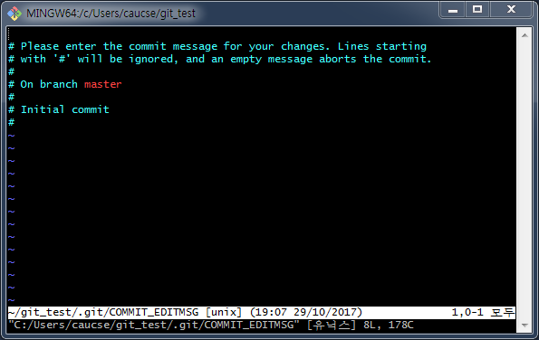
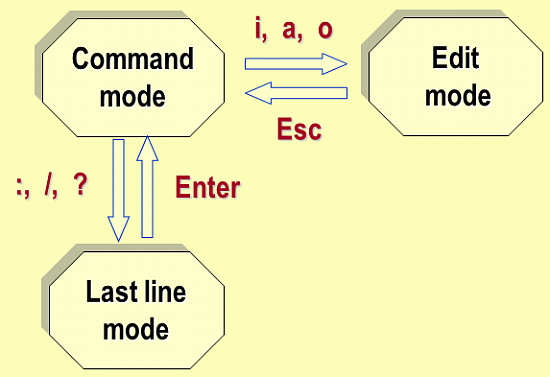
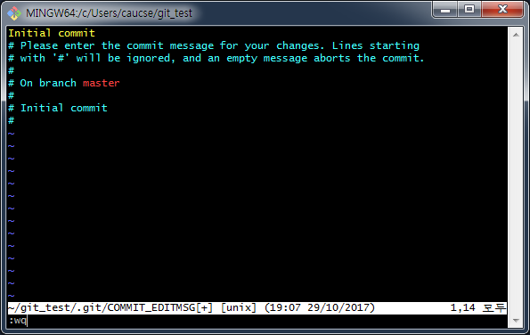

# Vi 에디터로 커밋 메시지 작성 방법

추천 읽기 자료: [vi란? - KLDP wiki](https://wiki.kldp.org/KoreanDoc/html/Vim_Guide-KLDP/Vim_Guide-KLDP.html)

## git-bash에서 vi를 사용해야 하는 경우

`git commit` 명령어를 사용하여 커밋을 생성할 때 해당 커밋이 어떤 변경을 포함하는지를 일종의 설명문을 담아야 합니다. git-bash에서 기본 텍스트 편집기는 Vi 에디터입니다.

- 윈도우즈 환경에서 아래 명령어를 통해 텍스트 편집기를 vi가 아닌 메모장으로 바꿀 수도 있습니다.
  > `git config --local core.editor notepad`

- commit 메시지를 한 줄로 간단하게 작성할 경우에는 `-m` 옵션을 주어서 메시지 편집을 생략할 수 있습니다.
  > `git commit -m "your commit message here"`

## Vi 기초

Vi를 처음 열면 아래처럼 화면이 나타납니다.

처음 화면에서는 텍스트 입력이 안될 수 있습니다. Vi는 아래 그림처럼 세 가지 모드가 있고, Vi가 처음 켜지면 `command mode`이고, `i`, `a`, `o` 키를 눌러 `edit mode`로 들어가야 텍스트 입력이 됩니다.

1. `git commit` 명령어로 vi를 켭니다
2. `i`를 눌러 `edit mode`로 들어갑니다. `edit mode`가 되면 아래 스크린샷처럼 맨 아래에 `-- 끼워넣기 --`가 나타납니다.
   > 

3. 커밋 메시지(예: `Initial commit`)를 입력하고 `esc` 키를 눌러 `edit mode`를 나간 뒤에 `:wq`를 차례대로 눌러 아래처럼 맨 아래 라인에 `:wq`가 입력되도록 합니다.
   > 

4. `w`는 저장, `q`는 편집기 종료를 나타냅니다. `wq`는 저장과 동시에 편집기를 종료하는 명령입니다.

   - `wq` 대신 `q!` 명령으로 저장하지 않고 나가면 커밋이 작성되지 않습니다.
   - 저장하였어도, 커밋 메시지가 없으면 커밋이 작성되지 않습니다.
   - 커밋 메시지 내의 `#`로 시작하는 줄은 주석 처리되어, 해당 줄은 커밋 메시지로 저장되지 않습니다.
