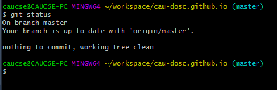
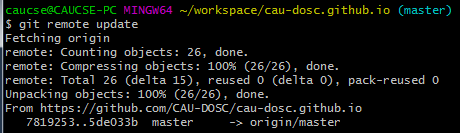
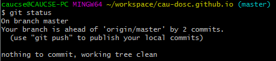
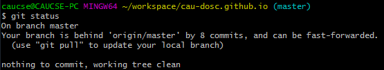
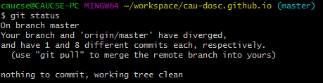
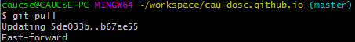
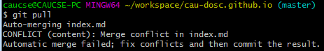

# GitHub에 올라온 커밋 합치기

## `git status`로 커밋을 합칠 수 있는 상태인지 확인하기

커밋을 합치기 위해서는 추적 중인 모든  파일이 Unmodified 상태이어야 합니다. 즉, 현재 수정 중인 내용이 있으면 commit으로 작성하여서, `git status`로 확인하였을 때 아래 스크린샷처럼 `nothing to commit, working tree clean` 메시지가 나오거나 `nothing added to commit but untracked files present` 메시지가 나와야 합니다. ([File Status Lifecycle 참고](https://git-scm.com/book/ko/v1/Git%EC%9D%98-%EA%B8%B0%EC%B4%88-%EC%88%98%EC%A0%95%ED%95%98%EA%B3%A0-%EC%A0%80%EC%9E%A5%EC%86%8C%EC%97%90-%EC%A0%80%EC%9E%A5%ED%95%98%EA%B8%B0))

## `git remote update` 명령어로 GitHub에 올라온 업데이트를 다운로드

## `git status` 명령어로 합칠 커밋이 있는지 확인

현재 작업 중인 PC와 GitHub의 상태에 따라 네 가지 경우가 있습니다.

1. 둘 다 업데이트가 없는 경우 (branch is up-to-date)

   

2. 작업 중인 PC에만 새로운 커밋이 있는 경우 (branch is ahead)

   

3. GitHub에만 새로운 커밋이 있는 경우 (branch is behind)

   

4. PC와 GitHub에 모두 새로운 커밋이 있는 경우 (branch have diverged)

   

## `git pull` 명령어로 합치기

GitHub에만 업데이트가 있는 3의 경우 `git pull` 명령어로 간단하게 합칠 수 있습니다.

4의 경우도 `git pull` 명령어로 합칠 수 있습니다. 다만, 내가 작성한 커밋과 충돌이 있을 경우 아래처럼 CONFLICT가 발생할 수 있습니다. 이 경우 [충돌 해결하기 문서](resolve-merge-conflict.html)를 참고하세요. 

