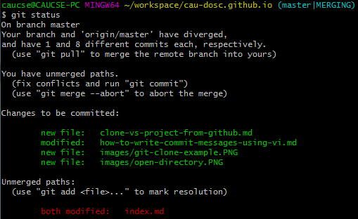

# 합병 충돌 해결하기

`git pull`/`git merge`/`git rebase` 등의 명령어 수행 도중에 아래처럼 충돌이 발생하면 이를 해결하여야 합니다.


## `git status`로 충돌난 파일 확인



 * `unmerged paths:` 목록에 있는 파일들이 충돌 해결이 필요한 파일들입니다.
   * 해당 파일을 Visual Studio 등으로 열어서 충돌을 수정한 다음, `git add`, `git commit`하면 충돌을 해결한 커밋(merge-commit)이 생성됩니다.

 * 충돌 발생 이전으로 되돌아가고 싶을 경우 `git merge --abort` 명령어로 되돌아 갈 수 있습니다.

## 충돌 부분 찾아 수정

Git에서의 충돌을 설명하기 위해 아래처럼 `source.cpp` 파일이 두 갈래로 나뉘어 commit 된 시나리오를 가정합니다.

- 패치 전 파일
    ```
    #include <stdio.h>
    int main () {
    	printf("Hello, world!\n");
    	return 0;
    }
    ```

- 내 PC에서 수정하여 commit한 파일
    ```
    #include <stdio.h>
    int main () {
    	printf("AAAAA\n");
    	return 0;
    }
    ```

- 팀원이 commit한 후 GitHub에 올린 파일
    ```
    #include <stdio.h>
    int main () {
    	printf("BBBBB\n");
    	return 0;
    }
    ```

내 PC에서 `git pull` 명령어로 합치기를 시도하면 `source.cpp`가 충돌하여 아래처럼 나타납니다.

```
#include <stdio.h>
int main () {
<<<<<<< HEAD
	printf("BBBBB\n");
=======
    printf("AAAAA\n");
>>>>>>> 4007bc0... 
	return 0;
}
```

`=======`, `>>>>>>>`, `<<<<<<<`를 지우고 그 안의 코드를 필요에 따라 수정한 뒤 저장합니다.

아래는 수정하여 저장한 예시입니다.

```
#include <stdio.h>
int main () {
	printf("AAAAA\nBBBBB\n");
	return 0;
}
```

저장한 뒤 해당 파일을 `git add` 명령어로 추가한 뒤 `git commit`을 수행하면 충돌을 해결한 커밋(merge-commit)이 생성됩니다.


## `git push`로 충돌 해결한 내용을 GitHub에 다시 업로드

충돌 해결한 커밋을 GitHub에 올려야 다른 사람이 내가 작성한 커밋이 합쳐진 내용을 다운로드할 수 있습니다.
