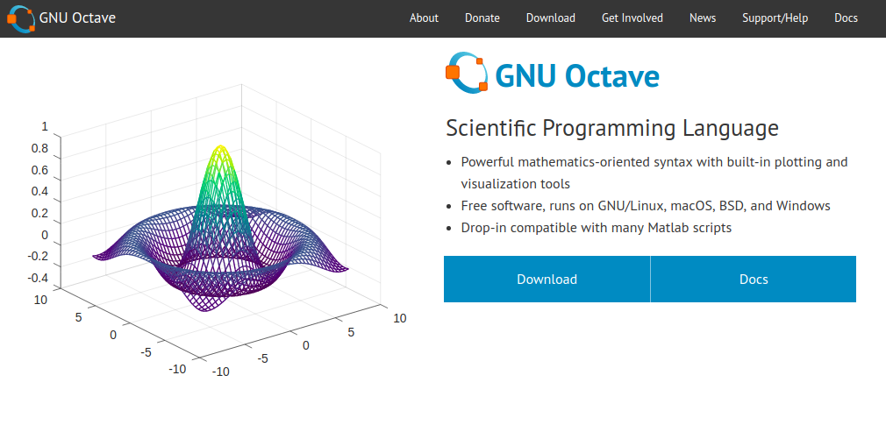
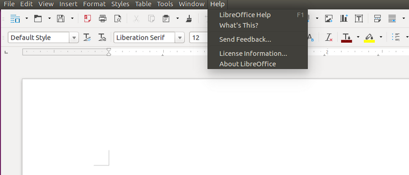
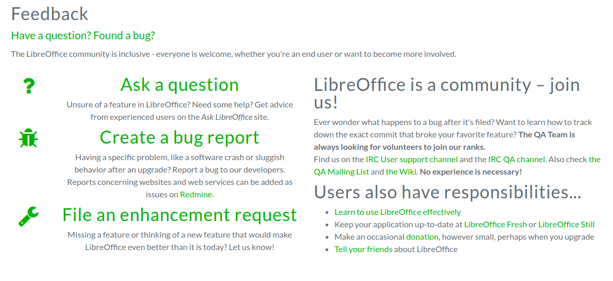
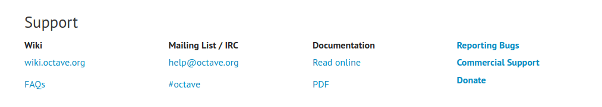

# 오픈소스 소프트웨어 활용 및 기여하기

오픈소스 소프트웨어를 무료로 사용하고 불편한 점이나 개선할 점을 피드백으로 제공하여 오픈소스 소프트웨어 개발에 기여할 수 있습니다. 

| 제품 구분 | 상용 소프트웨어 | 오픈소스 소프트웨어 |
| ------------- | ------------- | ------------- |
| 데스크탑OS | Windows, OS X | 리눅스 기반 배포판(우분투, 페도라 등) |
| 오피스 | MS 오피스 | 오픈오피스 |
| 연구용 소프트웨어 | 매트랩 | Octave |
| ... | ... | ... |

개인용 소프트웨어는 물론이고 이메일 서비스나 채팅 프로그램, 협업 프로그램 등도 오픈소스 소프트웨어 활용이 가능합니다. 예를 들어 GitHub의 유료 기능들을 무료로 사용하기 위해 오픈소스 프로젝트인 GitLab을 사용할 수도 있습니다.

| 제품 구분 | 상용 서비스 | Self-Hosting 가능한 오픈소스 프로젝트 |
| ------------- | ------------- | ------------- |
| 클라우드 스토리지 | 구글 드라이브 | OwnCloud |
| 프로젝트 호스팅 | GitHub | GitLab |
| ... | ... | ... | 

[https://opensource.com/resources/projects-and-applications](https://opensource.com/resources/projects-and-applications)
> Gmail, Trello 등 협업 도구, 생산성 도구, 유틸리티 등 오픈소스 대체품(alternatives) 정리된 목록

## 공식 홈페이지에서 다운로드 및 설치

사용하고자 하는 오픈소스 소프트웨어를 선택하고 사용하고자 하는 소프트웨어의 공식 홈페이지 등에서 제공하는 다운로드 방법을 참고하면 됩니다. 아래 스크린샷은 Octave의 공식 홈페이지입니다.

## 버그 리포트 혹은 개선점 제안

다운로드를 받아 소프트웨어를 사용하면서 불편한 점은 메뉴 혹은 홈페이지 등을 통해 피드백을 전달할 수 있습니다. 아래는 우분투에 기본 설치되어 있는 LibreOffice의 메뉴입니다. Help의 Send Feedback...을 누르면 웹 페이지로 이동하여 "Create a bug report"를 통해 **버그 리포트**를 하거나 "File an enhancement request"를 통해 **개선점을 제안**할 수 있습니다.

## 메일링리스트 구독 등 커뮤니티 참여

오픈소스 소프트웨어 개발은 목적에 따라 다양한 커뮤니케이션 툴을 가지고 있습니다. 일반적으로 홈페이지 하단에 기재되어 있습니다. 아래 스크린샷은 Octave 홈페이지 하단에 있는 내용입니다. Mailing-list와 IRC를 항목을 볼 수 있습니다.

메일링리스트는 해당 소프트웨어의 최신 소식을 접할 때 유용합니다. 최신 버전 등에서 추가된 기능이나 수정된 버그 내역들을 빠르게 확인할 수 있도록 메일을 보내줍니다. 버그 리포트를 하기 전 메일링리스트 등에서 해당 버그에 대한 논의나 이미 수정된 내용이 없는지 확인하는 것도 좋은 습관입니다.
IRC는 채팅으로 IRCCloud나 기타 여러 IRC 클라이언트를 사용하여 접속하는 채팅 프로그램입니다.

## (고급) 베타 버전, Nightly 버전 사용하기

현재 개발되고 있는 버전을 다운로드받아 사용하여 버그를 찾고, 즉시 개선점을 전달할 수 있습니다. 안정된 버전을 사용하면서 전달하는 피드백보다 더 비중있게 다뤄질 가능성이 높습니다.

---

[https://github.com/trending](https://github.com/trending)
> GitHub Trending: GitHub 저장소를 기준으로 활발하게 개발되는 오픈소스 프로젝트를 볼 수 있음, 언어별 필터 가능

[http://www.itworld.co.kr/news/106673](http://www.itworld.co.kr/news/106673)
> ITWorld, 2017 분야별 최고의 오픈소스 소프트웨어: 소프트웨어 개발 툴, 머신러닝 툴, 클라우드 컴퓨팅 소프트웨어, DB 및 분석 툴, 네트워킹 및 보안 소프트웨어

[http://www.itworld.co.kr/slideshow/98526](http://www.itworld.co.kr/slideshow/98526)
> ITWorld, 2016 오픈소스 프로젝트 14선

[https://opensource.com/resources/projects-and-applications](https://opensource.com/resources/projects-and-applications)
> Gmail, Trello 등 협업 도구, 생산성 도구, 유틸리티 등 오픈소스 대체품(alternatives) 정리된 목록

[https://opensource.com/article/16/12/yearbook-top-10-open-source-projects]( https://opensource.com/article/16/12/yearbook-top-10-open-source-projects)
> opensource.com, Top 10 open source projects of 2016
